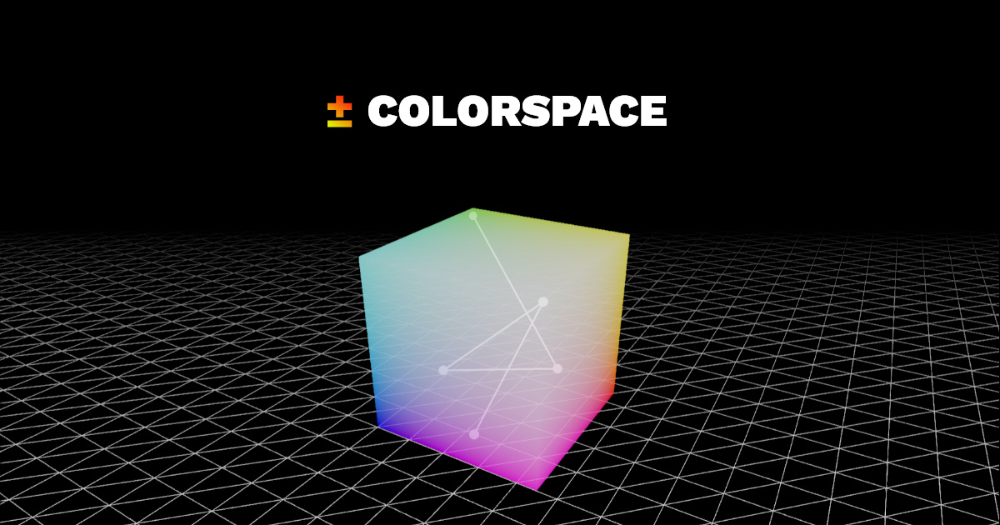

For the last few hundred years brands have been primarily consumed through real-world interaction. In 2022, that has shifted to a world where many brands never reach beyond a screen. This has led to an entire era of design in which brand colors are being determined and used entirely incorrectly.

In the same way that we do not mimic the methods used to create newspapers for digital content, a designer can get a massive helping by utilizing a colorspace that is defined around the thought of digital consumption.

Even the largest companies in the industry have been teaching and leading a method that is essentially as effective as _guess and check._ -- The general workflow of a designer looking for brand colors will go as:

- Define a general idea.

- Get close within the desired palette.

- Adjust the hue of the color slowing meshing around to find a color that "works".

The process is, and has been backwards this entire time. With the help of a 3D visualization we can see the colors with our scale (the key distinction here).

With the help of Colorspace it is suddenly possible to understand why the random colors being selected by other tools so 'rarely' work (and when they do, why they do.)

Let's look at an example:

Before we've taken a thought into the usage of the color space our gradient is muddied with grey as it transitions into a dark fade of red-blue. Not ideal, especially for a digital brand. You want it to be bright, not muddy!

For our after, with a little thought placed into the position of the colors we can reach a state where the scale of our brand contains far more potential.

There are a few general rules and the weight of their application will vary not only on the very specific definition of the output that one cannot realistically control.

Relying on the outer bound definitions of the scale we can walk a line from one to the other finding the most ideal path. With a simple rule we can immediately increase the quality of the colors chosen and used in a brand.

> A potentially very cool side note is that this makes it incredibly easy for color-blind designers to choose very nice and continuous color scales. Completely take the guess work out of it!

Colorspace can be used a lot of ways and the most ideal use will depend entirely on your workflow. Hop in!

## Available Scripts

In the project directory, you can run:

### `npm run dev`

Runs the app in the development mode.\
Open [http://localhost:8888](http://localhost:8888) to view it in your browser.

The page will reload when you make changes.\
You may also see any lint errors in the console. \
Running the project any other way will prevent OpenGraph images from working.

### `npm start`

Runs the app in the production mode.

### `npm run build`

Builds the app for production to the `build` folder.\
It correctly bundles React in production mode and optimizes the build for the best performance.

The build is minified and the filenames include the hashes.\
Your app is ready to be deployed!

See the section about [deployment](https://facebook.github.io/create-react-app/docs/deployment) for more information.

### `npm run eject`

**Note: this is a one-way operation. Once you `eject`, you can't go back!**

If you aren't satisfied with the build tool and configuration choices, you can `eject` at any time. This command will remove the single build dependency from your project.

Instead, it will copy all the configuration files and the transitive dependencies (webpack, Babel, ESLint, etc) right into your project so you have full control over them. All of the commands except `eject` will still work, but they will point to the copied scripts so you can tweak them. At this point you're on your own.

You don't have to ever use `eject`. The curated feature set is suitable for small and middle deployments, and you shouldn't feel obligated to use this feature. However we understand that this tool wouldn't be useful if you couldn't customize it when you are ready for it.
